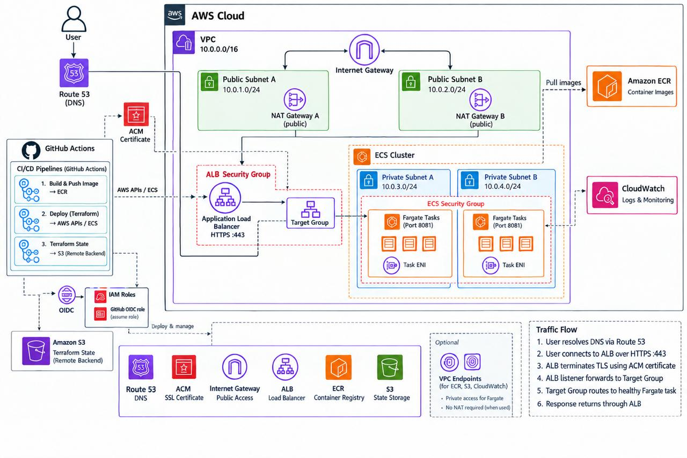

# Production-Grade Memos Deployment on ECS Fargate

A production-style deployment of **Memos**, a self-hosted note-taking application, running on **AWS ECS Fargate**. The project uses **Terraform** for modular infrastructure-as-code, **Docker** for containerisation, **Amazon ECR** for image storage, and **GitHub Actions** for CI/CD.

The application is secured with **HTTPS** through ACM and exposed through the custom domain **`ecsv1.online`**, with DNS hosted on **Route 53** and the domain registered.

---

## 📸 Live Application

🌐 **Live Domain:** [ecsv1.online](https://ecsv1.online/) `⚠️ Currently disabled/discontinued`


## 🏗️ Architecture Overview



**Flow:**

```text
Internet → Route 53 → ACM/HTTPS → ALB → ECS Fargate → Memos
```

### Key Decisions

* **ECS Fargate** removes the need to manage servers.
* **ECR** stores the container image used by ECS.
* **ALB** provides the public entry point and routes traffic to port `5230`..
* **ACM** provides HTTPS for `ecsv1.online`.
* **Route 53** hosts the DNS zone.
* **Terraform** manages the infrastructure through reusable modules.
* **S3** provides remote Terraform state with native S3 locking.

---

## Repository Structure

```text
Fargate-Memos-Deployment/
│
├── .github/workflows/
│   ├── build.yml
│   └── deploy.yml
│
├── app/memos/
│
├── infra/
│   ├── modules/
│   │   ├── vpc/
│   │   ├── ecr/
│   │   ├── ecs/
│   │   ├── iam/
│   │   ├── alb/
│   │   ├── acm/
│   │   └── route53/
│   │
│   ├── backend.tf
│   ├── main.tf
│   ├── outputs.tf
│   ├── provider.tf
│   └── variables.tf
│
├── Dockerfile
├── .dockerignore
└── README.md
```

---

## Infrastructure Components

### Networking

* **AWS VPC** and subnet networking
* **Route tables** and associations
* **Network ACLs**

### Compute & Containers

* **ECS Fargate**
* **Amazon ECR**
* Containerised **Memos** application
* Application exposed on port `5230`

### Load Balancing & TLS

* **Application Load Balancer**
* **AWS Certificate Manager**
* HTTPS for `ecsv1.online`

### DNS & State

* **Route 53** for DNS
* **Porkbun** for domain registration
* **S3** remote Terraform state
* Native **S3 state locking**

---

## CI/CD Pipeline

### Build - `build.yml`

* Authenticates to AWS using **GitHub OIDC**
* Builds the Docker image
* Pushes the image to **Amazon ECR**

### Deploy - `deploy.yml`

* Runs Terraform initialization and planning
* Applies infrastructure changes
* Performs a post-deployment health check against **https://ecsv1.online**
* Pipeline fails if the application does not return **HTTP 200**

---

## Tech Stack

### Cloud & Infrastructure

* **AWS**
* **Terraform**
* **ECS Fargate**
* **ECR**
* **VPC**
* **ALB**
* **ACM**
* **Route 53**
* **S3**

### CI/CD

* **GitHub Actions**
* **GitHub OIDC**

### Application

* **Memos**
* **Go**
* **Node.js / pnpm**
* **Docker**
* **Alpine Linux**

---

## Terraform Design

The infrastructure follows a **modular Terraform architecture**:

* `vpc` - networking
* `ecr` - container registry
* `ecs` - application workload
* `alb` - load balancing
* `acm` - TLS
* `route53` - DNS

The root **`main.tf`** acts as the orchestration layer, while resources remain inside their respective modules.

---

## Debugging Highlight

### Route 53 Hosted Zone Conflict

### Registrar Nameserver Mismatch

The issue was that **Porkbun** was still delegating the domain to nameservers from an older **Route 53 hosted zone**.

After updating Porkbun to the current Route 53 nameservers, **ACM validation completed within minutes**.

---

## Key Learnings

* DNS records only work when they exist in the **authoritative hosted zone**.
* Route 53 hosted zones receive their own nameservers when created.
* Terraform state needs to stay aligned with both configuration and real AWS resources.
* Migrating from **ClickOps to Terraform** requires careful resource ownership and state management.
* A successful infrastructure deployment still needs an **application-level health check**.

---

## 👤 Author

### **Yacin Djama**


🔗 [LinkedIn](https://linkedin.com/in/yacindjama) &nbsp;|&nbsp; 💻 [GitHub](https://github.com/YacinD) &nbsp;|&nbsp; ✉️ [Email](mailto:Yacin.Djama@hotmail.com)

---
